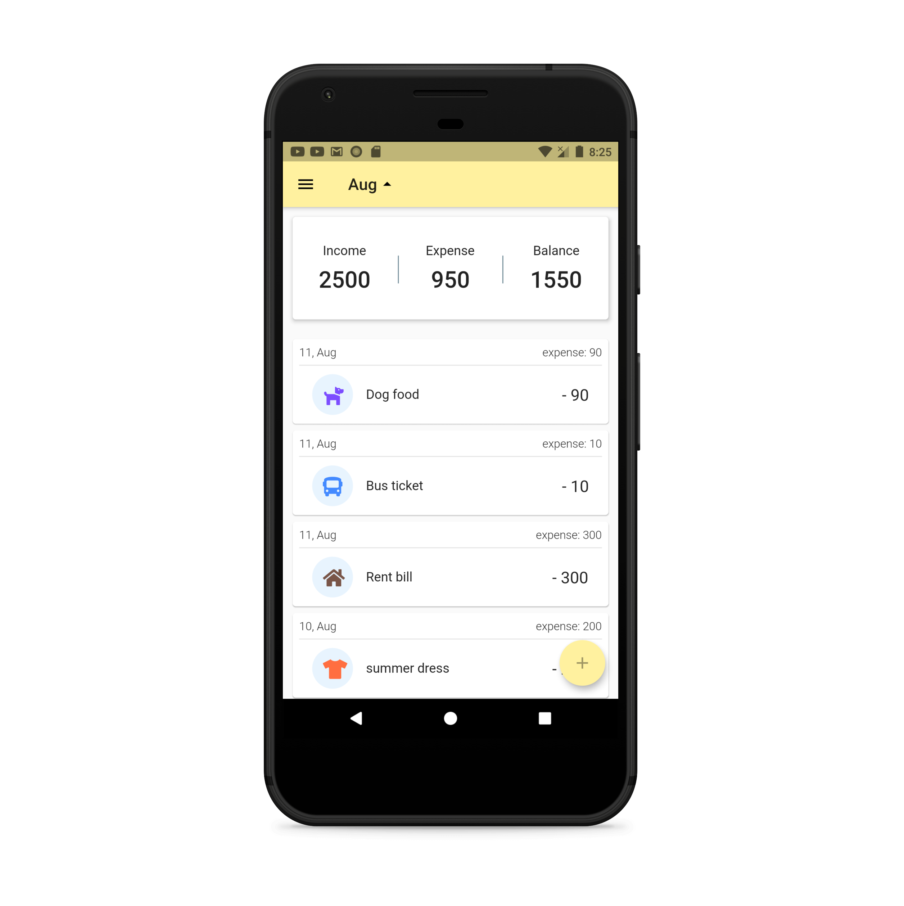
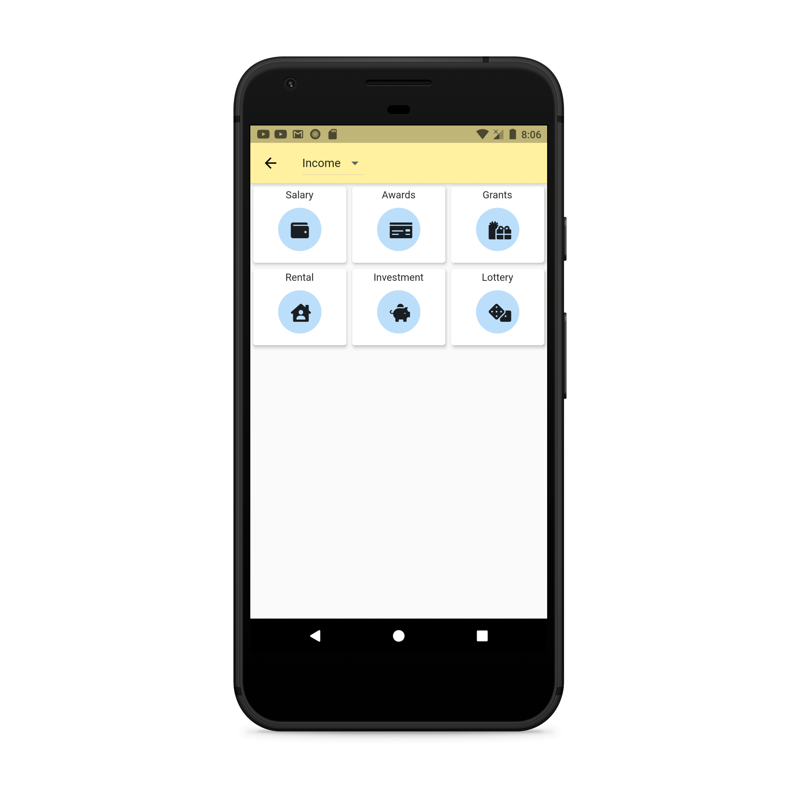
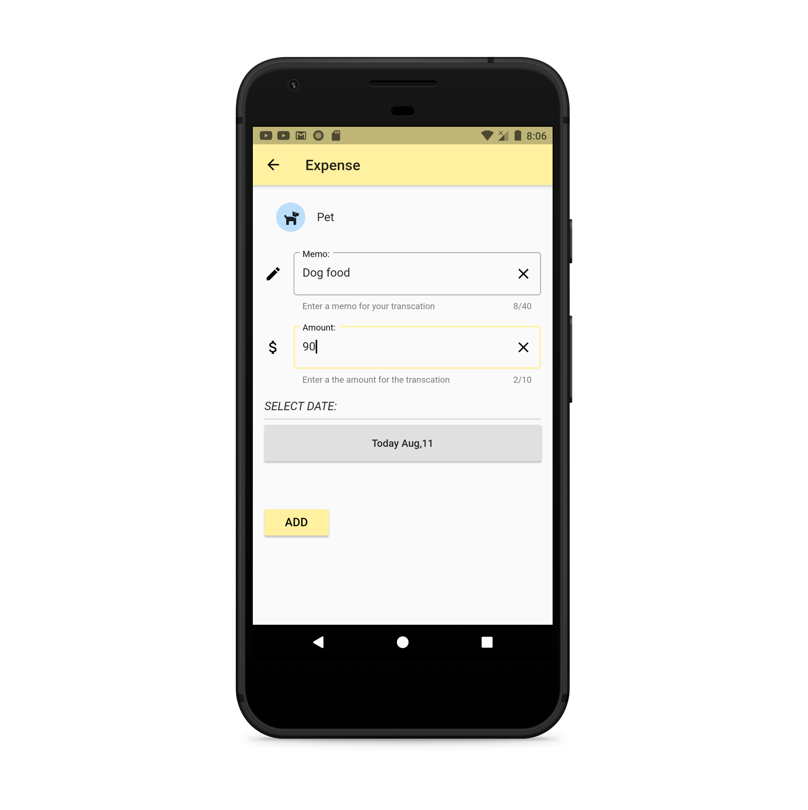
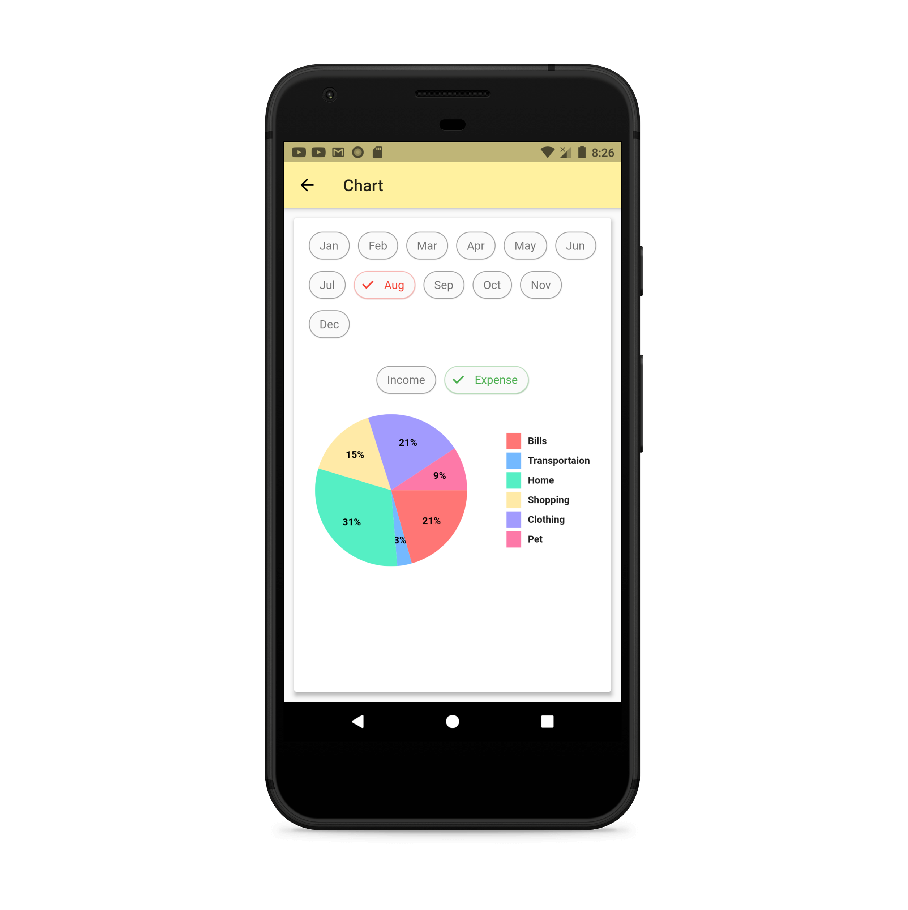

<strong>Money manager: Expense Tracker app [Flutter]</strong>

<strong>&nbsp;</strong>

All of your expenses in one place, we help you track your financial activity efficiently.

&nbsp;

<strong>Key Features: </strong>

<ul>
<li>Easy to use and clear interface.</li>
<li>Track your transactions to know where your money comes and goes.</li>
<li>See the whole picture on Pie Chart.</li>
<li>Set reminder to remain you to record transactions every day.</li>
</ul>

<strong>App Screenshots: </strong>

<strong>&nbsp;</strong>

<strong>What I used: </strong>

<ul>
<li>Flutter</li>
<li>Moor database</li>
<li>Provider for state management</li>
<li>MVVM architecture + get_it</li>
<li>flutter_local_notifications package</li>
</ul>

<strong>&nbsp;</strong>

<strong>Getting started: </strong>

<ul>
<li>Star&nbsp;⭐&nbsp;and clone&nbsp;<em>this</em>&nbsp;repo.</li>
<li>Open the project in VSCode or Android Studio.</li>
<li>Run <strong>flutter pub get</strong> to get the packages</li>
<li>Start your emulator</li>
<li>Run the app &amp; enjoy</li>
</ul>

<strong>Contact me for work:&nbsp;</strong><a href="mailto:musabapps2019@gmail.com"><strong>musabapps2019@gmail.com</strong></a>

&nbsp;

